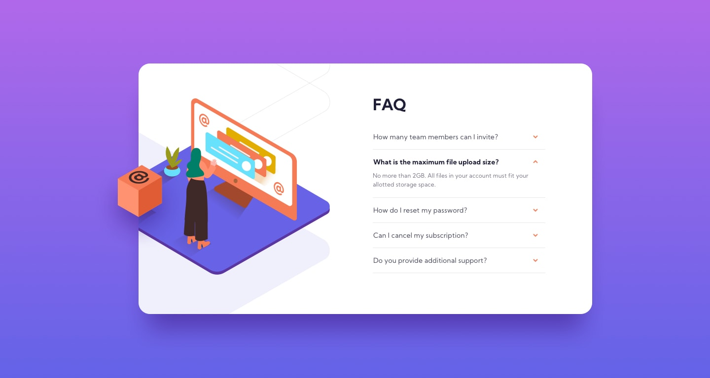

# Frontend Mentor - FAQ accordion card solution

Esta é uma solução para o Acordeão de perguntas. Os desafios do Frontend Mentor ajudam você a melhorar suas habilidades de codificação ao construir projetos realistas.

### O Desafio

Os usuários devem ser capazes de:

- Veja o layout ideal para o componente, dependendo do tamanho da tela do dispositivo
- Ver estados de foco para todos os elementos interativos na página
- Ocultar / mostrar a resposta a uma pergunta quando a pergunta é clicada

### Screenshot

### Links

- Solution URL: [solução](https://your-solution-url.com)
- Live Site URL: [live](https://acordeao-faq.vercel.app/)

### Usado para codificar

- Semantic HTML5 markup
- CSS custom properties
- Flexbox
- CSS Grid
- Mobile-first workflow

### Continuar desenvolvendo

  Tenho como ambição continuar desenvolvendo para minha melhoria profissional!

## Author

- Frontend Mentor - [@PatrickTav](https://www.frontendmentor.io/profile/PatrickTav)

